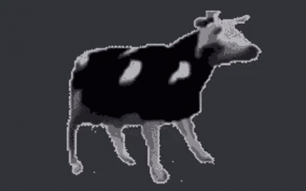

# 🐄 MEUH Encoding

A fun Java project that encodes and decodes text using a custom binary-based system inspired by the cow “MEUH”.

Each letter of your input text is converted into binary (8 bits).
Then, each bit is represented by the letters `M`, `E`, `U`, `H` —
**uppercase** for `1` and **lowercase** for `0`.

In other words, every byte becomes a pair of MEUH sequences,
one for the first 4 bits, and another for the last 4 bits.

---

## Example

For the letter `a`:

```
'a' → ASCII 97 → binary 01100001
```

Encoding rule:
`0 → lowercase`, `1 → uppercase`

Mapping over `M E U H M E U H`:

```
01100001 → mEUh meuH
```

Result:

```
mEUh meuH
```

Decoding reverses the process:
Uppercase becomes `1`, lowercase becomes `0`,
and every 8 bits are converted back to the original character.

---

## Usage

### Run

```bash
java Main
```

You’ll see:

```
************************************************
*********** Welcome to MEUH encoding ***********
************************************************

1. encode
2. decode
select a function :
```

### Encoding Example

```
select a function : 1
Please enter a sentence :
a
```

Output:

```
mEUh meuH
```

### Decoding Example

```
select a function : 2
Please enter the key :
mEUh meuH
```

Output:

```
a
```

---

## How It Works

1. **Encoding**

   * Each character → 8-bit binary
   * Each bit → `M/E/U/H`

     * Uppercase = `1`
     * Lowercase = `0`
   * Groups of 4 bits separated by spaces for readability.

2. **Decoding**

   * Ignores spaces.
   * Reads groups of 8 letters.
   * Converts uppercase/lowercase back into binary.
   * Translates binary → original character.

---

## Example Session

```
Input  : test
Binary : 01110100 01100101 01110011 01110100
Output : mEUH mEuh mEUh mEuH mEUH meUH mEUH mEuh
```

Decoding it back gives you:

```
test
```

---

## License

MIT License — free to use, modify, and share while keeping the playful spirit alive.

---
Have fun with my project and the cows will thank you <br>
Thank you for your visit 🐄


